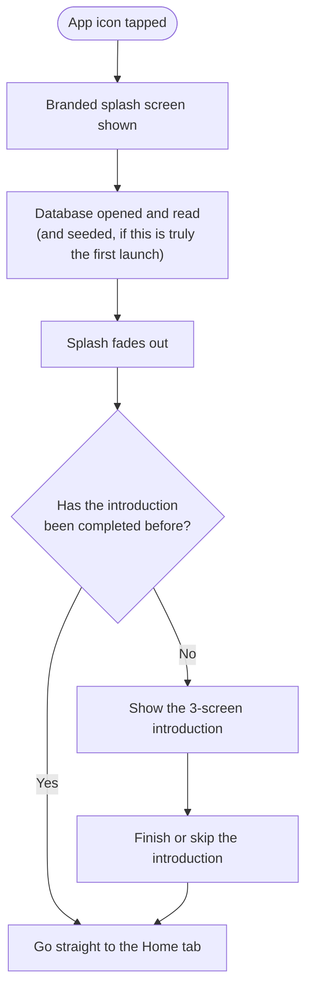
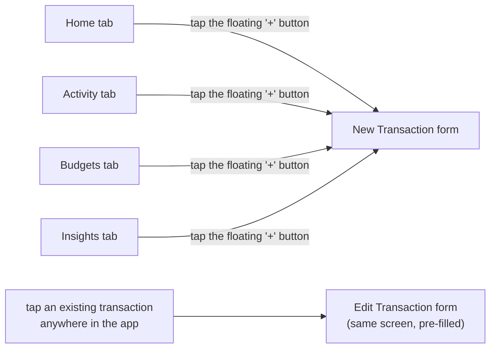
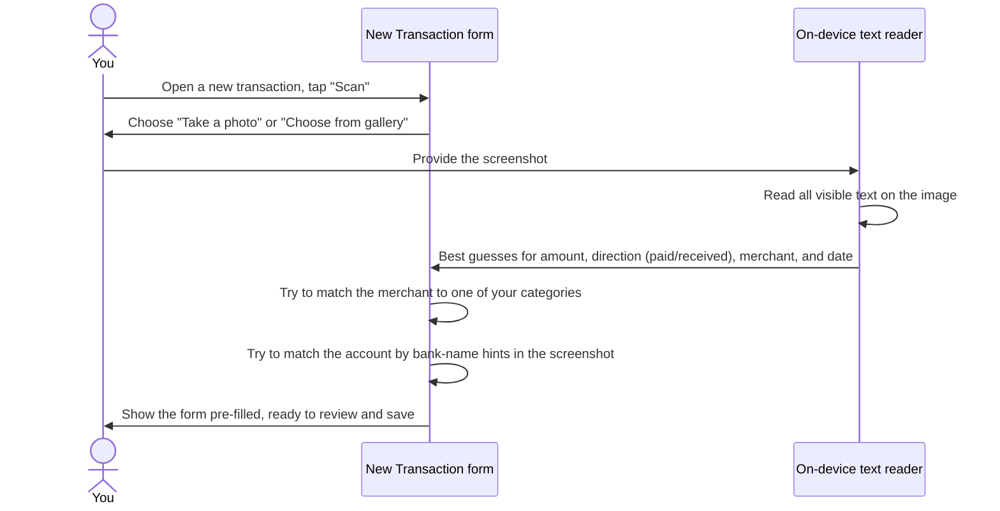
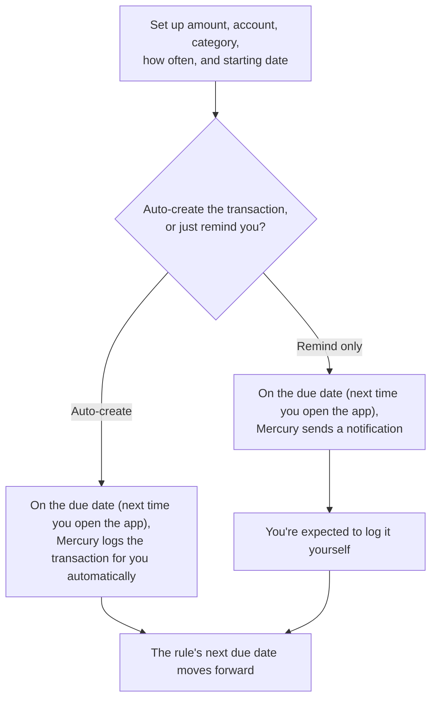
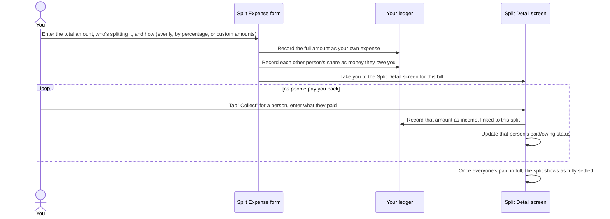
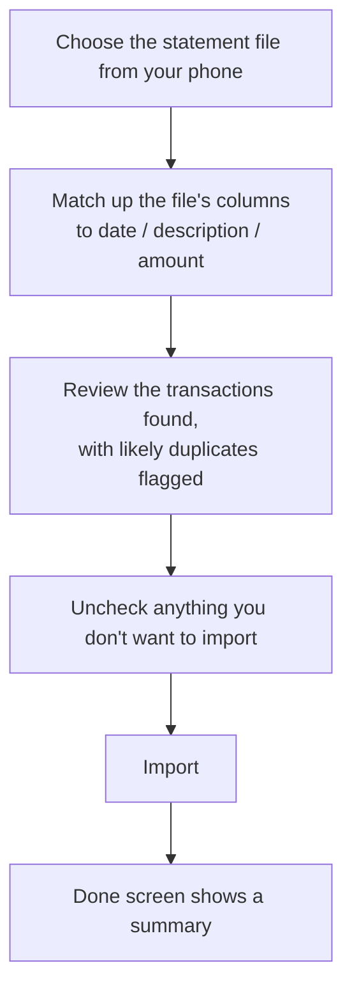
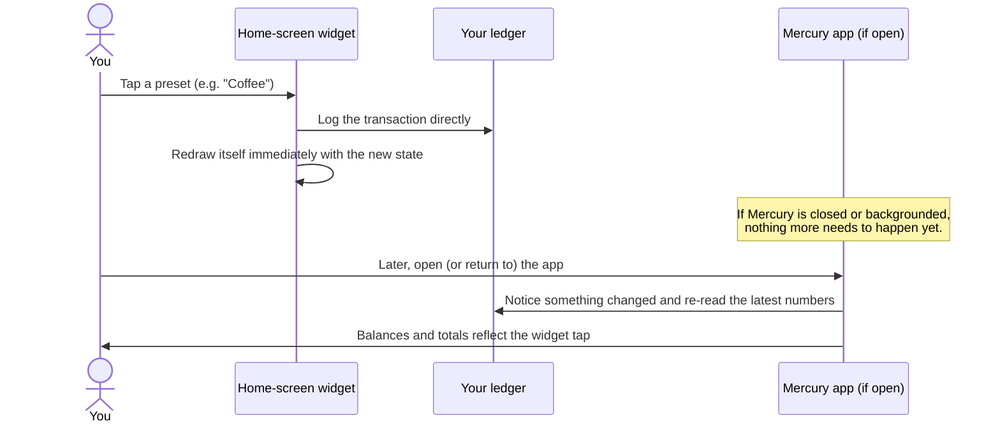
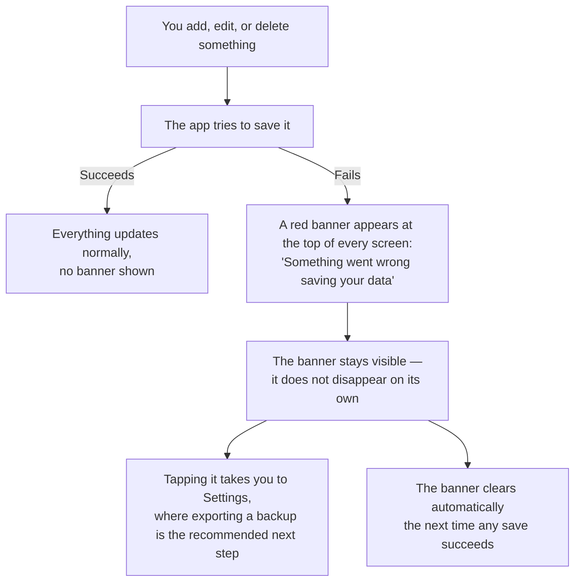

# Mercury — Lifecycle and Journeys

This is the plain-English walk-through of what actually happens, step by
step, as a person uses Mercury — from the very first launch through the
everyday journeys (logging a transaction, splitting a bill, importing
data) and what happens when something goes wrong. No code, no file paths,
no syntax — just the sequence of events, in the order a person would
experience them, including the rough edges.

Mercury has no accounts and no login, so there's no "logged-in vs
logged-out" distinction the way a cloud app would have. The meaningful
split instead is **first-time use** vs. **every launch after that**, and
whether the phone currently has a network connection at all (which, for
almost everything in Mercury, doesn't matter — more on that below).

---

## Launching the app

### What happens on every launch, first time or the thousandth

1. The phone shows the operating system's own splash screen the instant
   you tap the app icon — this is standard for any app and isn't Mercury's
   own design.
2. The moment Mercury's own code starts running, it takes over from that
   system splash with its own branded splash screen — the app icon
   centered on a plain white background, with the version number pinned
   near the bottom.
3. Behind that splash screen, two things happen at once, invisibly: the
   custom lettering Mercury uses gets loaded, and the on-device database
   gets opened, checked for any pending structural updates, and read.
4. If this is the very first time the app has ever opened, the database is
   empty, so Mercury quietly creates some starting points for you — a
   default set of income and expense categories, four ready-to-use quick
   presets for the home-screen widget (Coffee, Commute, Groceries,
   Snacks), and one starter account called "Cash" with a zero balance —
   before showing you anything.
5. Once that's ready, Mercury's own splash screen fades out, revealing
   whatever comes next (see below). The fade always takes a brief moment
   even if the database opened instantly — it's a deliberate, minimum-length
   transition, not a loading indicator you're waiting on.
6. Whatever happens next branches on one question: **have you finished the
   introduction before?**

### First-time: the introduction

If you've never opened Mercury before, you see a short, three-screen
introduction before anything else — each screen makes one point (your
spending in one place; your data never leaves your phone; budgets and
insights that actually help), with a "Next" button to advance and a "Skip"
option available from the very first screen. You can also go back a screen
if you change your mind. Finishing the last screen (or skipping at any
point) marks the introduction as done, permanently — it will never show
again on this device, even after the app restarts, unless the whole app is
reinstalled.

### Every launch after that

Returning users skip straight past the introduction to the Home tab —
there's no "welcome back" screen, no login step, nothing to re-enter. If
you had unsynced or pending work of any kind, there isn't any — because
everything was already saved to the on-device database the moment you did
it, there's nothing left "in progress" between one launch and the next.

### Offline vs. online

For the overwhelming majority of what Mercury does, this question simply
doesn't apply — there is no server to be offline *from*. Adding a
transaction, checking a balance, viewing insights, creating a budget — all
of it reads and writes only the on-device database, identically whether
your phone has signal or not. The only places a network connection
matters at all are the one-time request to load the app's custom fonts and
icons during development/updates (not something you'd notice as a user)
and nothing else in day-to-day use — there is no feature in the app that
requires the internet to function.

---

## Everyday journey: adding a transaction

The single most common thing you'll do in Mercury. There are three ways
into the same form:

The floating "+" button sits in the middle of the bottom navigation bar
and is visible on all four main tabs — wherever you are, adding a
transaction is one tap away, and it always opens a blank form, regardless
of which tab you tapped it from.

Once on the form: you choose whether it's an expense, income, or a
transfer between two of your own accounts; type an amount on a
purpose-built number pad; pick an account and a category (and, if you've
set any up, a more specific subcategory); optionally add a note, a payee
name, a date other than today, and either turn it into a recurring payment
or split it with other people. Saving takes you straight back to wherever
you came from, with the new transaction already reflected in every
balance and chart that depends on it — there is no separate "sync" step or
delay.

---

## Everyday journey: scanning a payment screenshot

If you've just paid someone through a UPI or similar payment app and have
a screenshot of the confirmation, Mercury can read it for you instead of
you typing everything by hand.

Everything here happens entirely on your phone — the screenshot is never
sent anywhere. The reading is a best-effort guess, not a guarantee: it
works well for the common UPI-style payment confirmation layout, but a
merchant name it doesn't recognize, or a category you've renamed since the
app's defaults, may simply not get matched — in that case, the form still
opens, just with fewer fields pre-filled, and you fill in the rest
yourself exactly as if you'd started from a blank form.

### Sharing a screenshot from another app

Android lets you share an image directly from your gallery or another app
straight into Mercury via the system share sheet, and Mercury does appear
as a target for that. As of this writing, though, doing so only opens a
**blank** new-transaction form — the shared image itself is not currently
read or used to pre-fill anything, even though the intent of the feature
is the same as the in-app "Scan" button described above. If you want the
scan-and-prefill experience, use the "Scan" button inside the New
Transaction form directly rather than sharing from outside the app.

---

## Everyday journey: setting up a recurring payment

For money that moves on a predictable schedule — rent, a subscription, a
salary — Mercury can track it as a recurring rule rather than you having
to remember to log it every time.

A few honest caveats worth knowing:

- **Mercury only checks for due recurring payments when you open the
  app**, not continuously in the background — there's no server or hidden
  process ticking away while the app is closed. This is fine for
  day-to-day use (you probably open a finance app regularly), but it means
  the check only happens at the moment the app comes to the foreground.
- **If a reminder-only rule's due date passes and you don't act on it**,
  the reminder doesn't come back and there's no transaction created either
  — the app simply notes that the due date has passed and moves the rule's
  next due date forward. Tapping the reminder notification does not take
  you anywhere specific in the app right now. Practically, this means a
  reminder-based recurring payment works best if you treat the
  notification itself as the moment to open the app and log it — waiting
  and expecting to catch up later isn't currently supported.
- **If you don't open the app for a long stretch** (say, a couple of
  months) and have a monthly recurring rule, opening the app again only
  catches up the single most recent missed occurrence, not every one that
  was missed in between — the rest are simply skipped past silently, with
  no record that they happened. If you rely on auto-created recurring
  transactions for a bill you pay monthly, it's worth opening the app at
  least roughly as often as the recurring payment repeats.

---

## Everyday journey: splitting a bill

For a shared expense — dinner with friends, a group trip cost — where you
paid the full amount and others owe you back.

Splitting evenly divides the total as fairly as possible, but if it
doesn't divide perfectly evenly (say, three people splitting a bill that
isn't a multiple of three), the small leftover cent or two is added to the
last person's share rather than yours — you're always credited the full,
exact original amount as your own expense regardless of how the split
divides. Splitting by percentage or by custom amounts requires the shares
to add up to (close enough to) the total before you're allowed to save.

One caveat worth knowing: if you start a split expense from inside the
regular "New Transaction" form (via its "Split" option) rather than from
the dedicated Split Expense screen, your own share of the bill can end up
incorrectly tracked as still "owed" alongside everyone else's, even though
you obviously don't owe yourself anything — you may see the split listed
as not-yet-fully-settled even after every other person has genuinely paid
you back in full, and you might see a "Collect" option for yourself. If
you hit this, using the dedicated Split Expense screen (reachable from the
Insights tab's "Shared" view) to create the split avoids the issue
entirely.

---

## Everyday journey: importing your data

Mercury supports two entirely different kinds of import, for two different
purposes — it's worth knowing which one you want.

### Restoring your own Mercury backup

If you've previously exported your data from Mercury (accounts,
transactions, budgets, categories, settings — everything), you can bring
it back in, either on the same device after a reset or on a new device.
You choose to either merge the backup into what's already there (anything
that already exists by its original identity is left alone, so importing
the same backup twice doesn't double anything) or replace everything
currently in the app. Progress is shown live as it processes, and if it's
a large file, it can run in the background with a notification when it
finishes — you don't have to keep the import screen open and watching.

### Importing a bank statement

If your bank lets you download your transaction history as a spreadsheet
file, Mercury can read that in and turn each row into a transaction,
without you retyping everything by hand.

**This feature currently does not work correctly.** Rows from the
statement do get written into your transaction history, but a bug in how
those new transactions update your account balances and charts means
those numbers are never actually updated — imported transactions won't
show up in your account balance, your budget progress, or any of the
Insights charts, even though they technically exist in your transaction
list if you scroll to find them. The "Done" screen will also tell you "0
transactions imported" even when rows were, in fact, written — the app
isn't currently able to tell you accurately whether this worked. Until
this is fixed, importing a bank statement isn't a reliable way to bring
your history into Mercury; entering transactions manually, or using the
"Scan" feature on payment screenshots, are the dependable options.

---

## Everyday journey: using the home-screen widget

Outside the app entirely, you can add a small Mercury widget to your
phone's home screen for one-tap logging of a preset transaction (say, a
fixed "Coffee, ₹150" preset) without unlocking into the app at all.

The widget itself resizes: drag it larger on your home screen and it
automatically shows more presets and, at larger sizes, account balances
alongside them; shrink it and it simplifies down to just the essentials.
You can manage which presets are available to the widget from inside the
app's settings.

---

## When something goes wrong

Mercury is built so that a failure never corrupts or loses your data — the
worst case is always "the app tells you something's wrong and asks you to
back up," never "your data silently disappears."

This banner is deliberately persistent rather than a toast that
disappears after a few seconds — the reasoning is that a failed save means
what's on your screen may now be ahead of what's actually saved to disk,
and that's worth staying visible until it's resolved rather than being
easy to miss. Smaller, more routine failures (like a receipt scan that
couldn't read the image, or accidentally trying to delete something) show
up instead as a normal pop-up alert with an OK button — not this
persistent banner, which is reserved specifically for save failures.

If the app itself fails to load your data at startup (a much rarer case),
it doesn't get stuck on the splash screen forever — it goes ahead and
shows you the app anyway, just with the same red banner up front, so
you're never left staring at a frozen loading screen with no explanation.
