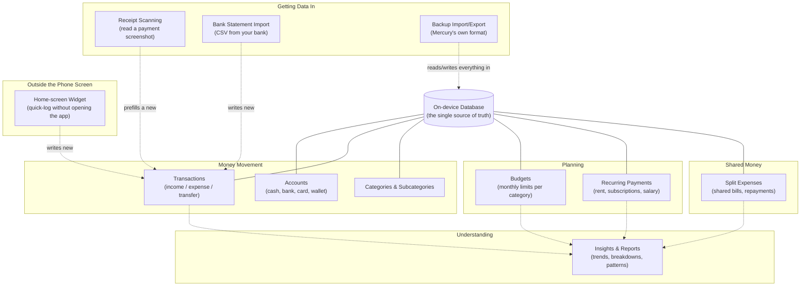

# Mercury — System Overview

This is the plain-English companion to the technical documentation. It
explains what Mercury is and how its pieces fit together, without code,
file paths, or syntax — written for anyone on the team who wants to
understand how the app works conceptually, whether or not they write code.

---

## What Mercury is

Mercury is a personal finance app for tracking spending, budgets, and
accounts. It runs entirely on your phone. There is no server, no account
to log into, no cloud sync, and no company watching your spending from the
outside — every number you see was calculated on your own device, from
data that has never left it. If you want a copy of your data elsewhere,
you export it yourself as a file and share it however you choose; nothing
leaves automatically.

That single fact — "everything lives on the phone, nothing calls home" —
shapes almost every other design decision described below.

---

## The big picture: how the pieces talk to each other

Think of Mercury as three layers, stacked:

1. **The vault.** At the bottom sits a private, on-device database — the
   single source of truth for every account, transaction, budget, category,
   and setting you have. Nothing in the app is allowed to touch this vault
   directly except through one guarded doorway (described next). This is
   what makes the "offline-only, no server" promise real: there is nowhere
   else the data could be.

2. **The ledger keeper.** Rather than re-adding up your entire transaction
   history every time a screen needs a number — which would get slower and
   slower as your history grows — Mercury keeps a set of *running totals*
   next to the vault: your current balance per account, your spending per
   category per month, how many transactions you have. Every time a
   transaction is added, changed, or deleted, the ledger keeper updates
   just those running totals — undoing the old transaction's effect first,
   then applying the new one — rather than recalculating from scratch.
   This is why the app stays fast even with a huge amount of history: no
   screen ever has to scan your whole history to answer "what's my
   balance," it just reads the running total.

3. **The screens.** Every screen you look at — Home, Activity, Budgets,
   Insights, and all the pop-up forms — reads from the vault (usually via
   the ledger keeper's running totals, sometimes with a direct, narrow
   question when it needs something the running totals don't cover, like a
   text search). None of them keep their own private copy of "the truth" —
   they all ask the vault fresh, every time they need to know something.

### How a change reaches every screen

When you add a transaction on one screen, how does the Home screen's
balance update without you having to manually refresh it? Mercury uses a
simple mechanism: a single shared "something changed" signal. Any part of
the app that writes to the vault flips this signal; any screen that's
currently showing data is listening for the signal and re-reads its data
when it flips. It's deliberately coarse — it doesn't try to say *which*
piece of data changed, just that *something* did — which keeps the
mechanism simple and reliable at the cost of occasionally refreshing a
screen that didn't strictly need it. That tradeoff was a deliberate choice,
not an oversight, and it's been specifically investigated as a possible
source of slowdown and kept as-is after review.

This same signal is also how a home-screen widget (see below) and the main
app stay in sync, even though the widget technically runs in its own
separate mini-program behind the scenes: tapping the widget writes to the
same vault and flips the same signal, and the app catches up the moment
you bring it back to the foreground.

---

## The domains

Mercury's features group into a handful of domains. The diagram below
shows how they relate — solid lines mean "directly built from," dashed
lines mean "reads from" without owning the data.

- **Accounts** are the places money sits — a cash wallet, a bank account, a
  card. Every transaction belongs to exactly one account (or, for a
  transfer, moves between two).
- **Transactions** are the atomic events: money coming in, money going
  out, or money moving between your own accounts. Everything else in the
  app is built on top of transactions.
- **Categories and Subcategories** classify *what* a transaction was for
  (Groceries, Rent, Salary) and, optionally, a more specific sub-type
  underneath a category (e.g. "Groceries → Fruits & Vegetables").
- **Budgets** are monthly spending limits you set per category, with
  progress tracked automatically as matching transactions come in.
- **Recurring Payments** represent money that moves on a schedule — rent,
  a subscription, a salary. Mercury can either create the transaction for
  you automatically when it's due, or just remind you so you can log it
  yourself.
- **Split Expenses** handle a bill you paid that other people owe you
  back for — you record the full amount as your own expense, then track
  each person's share and whether they've paid you back.
- **Insights & Reports** don't own any data of their own — they're a lens
  over everything above: spending trends over time, a category breakdown,
  which weekdays you spend the most, your recurring commitments, and your
  outstanding splits.
- **Getting data in** covers the three non-manual ways a transaction can
  enter the vault: scanning a payment screenshot, importing a bank's CSV
  statement, or restoring a Mercury backup file.
- **The widget** is a small program that lives on your phone's home
  screen, outside the app itself, that can log a quick preset transaction
  (like "Coffee, ₹150") with one tap, without opening Mercury at all.

---

## The two kinds of screens

Every screen in Mercury is one of two kinds, and they behave differently
on purpose:

- **The four main tabs** — Home, Activity, Budgets, Insights — are always
  reachable via a floating pill-shaped bar at the bottom of the screen.
  Switching between them feels like flipping between views of the same
  underlying data, with a quick shift-style transition.
- **Everything else is a pop-up screen** — adding a transaction, editing an
  account, managing categories, settings, and so on. These slide up over
  whatever you were looking at and are dismissed with a close button or by
  swiping back, always returning you to exactly where you were.

A center "+" button, always visible in the tab bar regardless of which tab
you're on, is the fastest way to log a new transaction from anywhere.

For the full map of every screen and how they connect, see
`SCREEN_MAP_AND_BEHAVIOR.md`. For a narrative walk-through of what happens
on first launch, returning launches, and specific real journeys (adding a
transaction, importing data, splitting a bill), see
`LIFECYCLE_AND_JOURNEYS.md`.

---

## The look and feel, briefly

Mercury's visual identity is a soft, glass-like aesthetic: a gentle
gradient wash behind every screen, translucent frosted cards, a
morphing-blob "hero" card on the Home screen that shows your balance, and
a floating pill-shaped navigation bar. It's a single consistent light
theme — there is currently no dark mode. Motion throughout the app is
deliberately restrained: things animate when you cause them to (opening a
screen, tapping a button, a number changing), not on a constant ambient
loop, because idle animation was found early on to be the app's biggest
source of visible slowdown on real devices. A couple of very subtle
background effects were kept as intentional exceptions, but only after
being shown not to cost noticeable performance, and they turn themselves
off automatically if your phone's accessibility settings ask for reduced
motion.

---

## What Mercury deliberately is not

- It is not a multi-device or multi-user product — there's no login, no
  account, no way for two phones to see the same data unless you manually
  export from one and import into the other.
- It does not talk to your bank in real time — the "bank import" feature
  reads a CSV file you download from your bank yourself and hand it to the
  app; nothing connects to a bank automatically.
- It does not run anything in the background beyond what the operating
  system allows a foregrounded or just-resumed app to do — there's no
  server-side job, no push-triggered background sync. Anything that needs
  to "notice" something (a due recurring payment, a widget tap) catches up
  the next time you open the app, not continuously.
